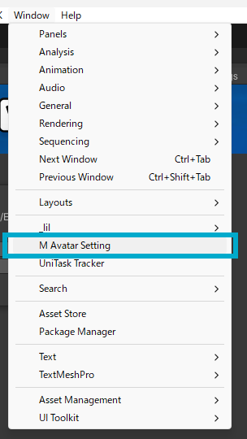
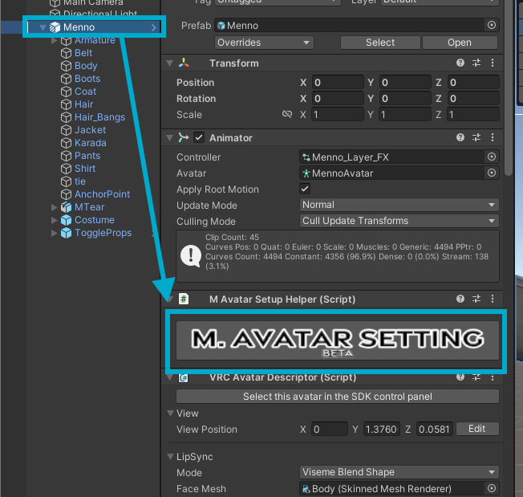
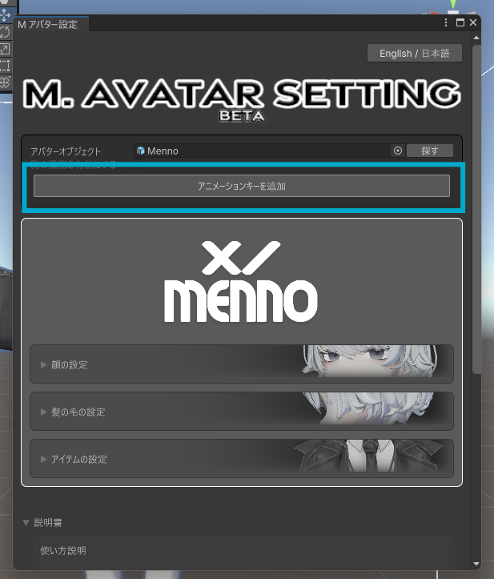

# M. Avatar Setting

M. Avatar Settingは、Unity用のエディタ拡張ツールで、VRChat用のアバター（Menno）の設定を簡単に行うことができます。

## 前提条件

M. Avatar Settingは以下のツールを前提としています：
- [Modular Avatar](https://github.com/bdunderscore/modular-avatar/releases)
- [Liltoon](https://booth.pm/ja/items/3087170)

これらのツールが事前にインストールされていることを確認してください。

## M. Avatar Settingの起動方法

M. Avatar Settingには、以下の2つの方法で起動できます：

### 1. メニューから起動

Unityのメニューから`Window > M Avatar Setting`を選択することで、M. Avatar Settingウィンドウを開くことができます。

### 2. M. Avatar Setup Helperから起動

アバターを選択した状態で、Inspector上に表示される「M. Avatar Setup Helper」コンポーネント内の「M. Avatar Settingを開く」ボタンをクリックすることでも起動できます。この方法では、アバターが自動的に選択された状態でウィンドウが開きます。

## 自動セットアップ機能

M. Avatar Settingには、アバターの設定を自動化するいくつかの機能があります。

### アニメーションキーの追加

「アニメーションキーを追加」ボタンを使用すると、Expression Menuにある「ライティング調整」Radial Puppetで使用されるアニメーションに、アバターの階層にあるマテリアルのすべての明るさの下限（_LightMinLimit）を自動的に登録できます。

#### 使用方法

1. M. Avatar Settingウィンドウを開きます
2. アバターを選択します
3. 「アニメーションキーを追加」ボタンをクリックします

#### 注意点

* 現在の実装では、Modular Avatarで階層を変更するコンポーネントについては対応していません
* 今後のアップデートで対応予定です

## アバター固有の設定

M. Avatar Settingでは、アバターの種類によって表示される設定が異なります。

* [Mennoの設定](../menno/) - Mennoアバター固有の設定

## その他の機能

* [更新履歴](history/) - M. Avatar Settingとアバターのアップデート情報 